# Express Book Reviews

## Description
This project is a server-side application designed for an online book retailer, enabling users to manage book ratings and reviews, search for books by ISBN, author, and title, as well as register, log in, and modify their own reviews.

## Features
- Retrieve a list of all books available in the bookshop
- Search for specific books by ISBN, author names, and titles
- Retrieve reviews/comments for specified books
- Register as a new user
- Login to the application
- Add a new review for a book (logged in users only)
- Modify a book review (logged in users can modify only their own reviews)
- Delete a book review (logged in users can delete only their own reviews)
- Simultaneous access for multiple users to view and manage different book reviews
## Screenshots

### List of All Books
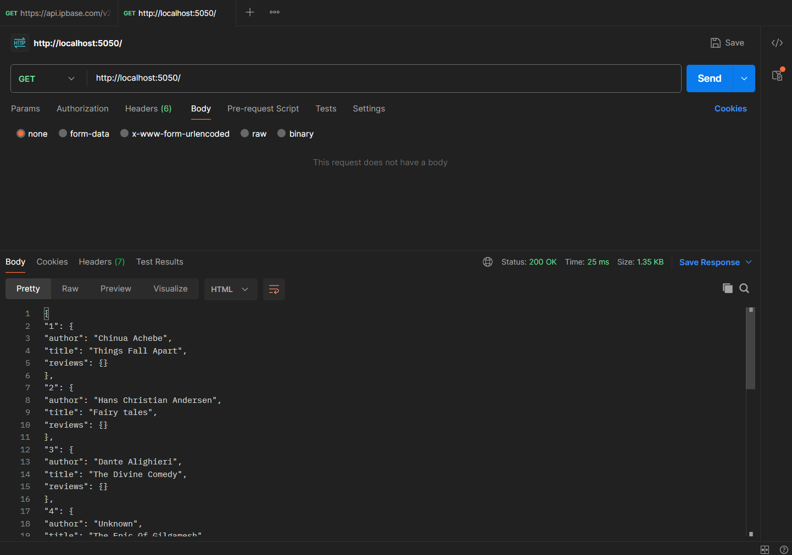

### Get Details by ISBN
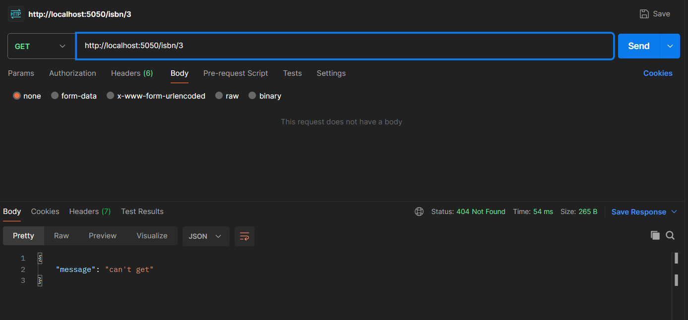

### Get Books by Author
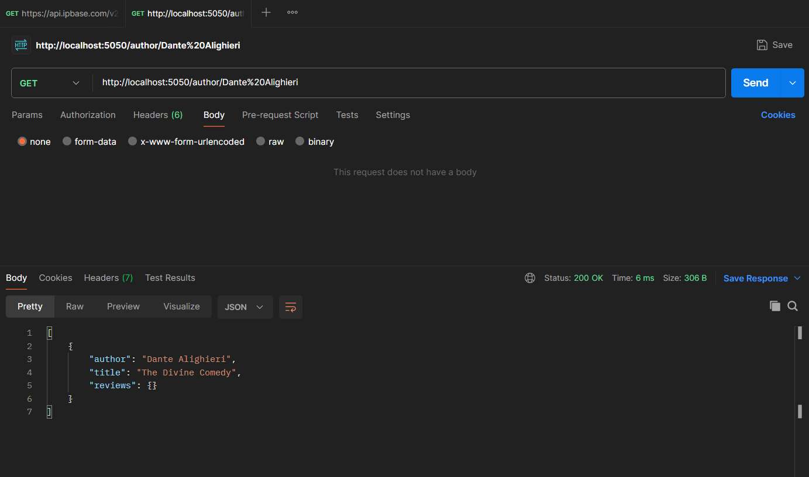

### Get Books by Title
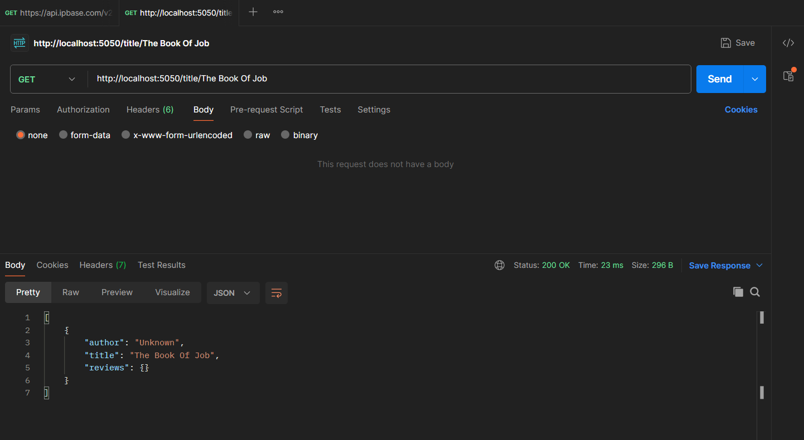

### Get Book Review
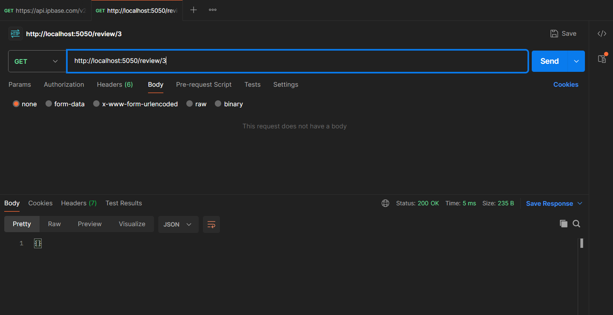

### User Registration
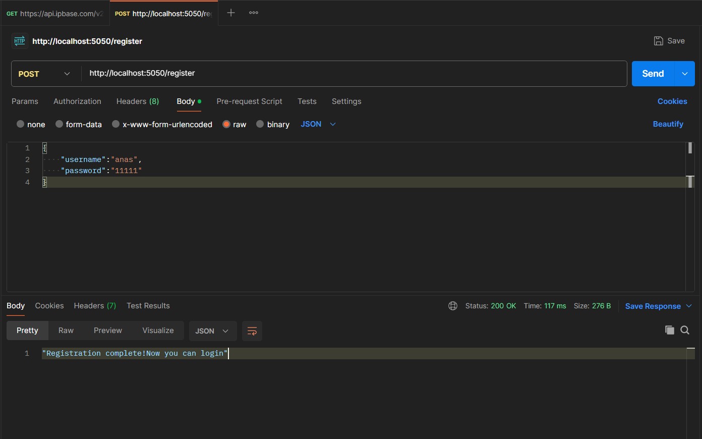

### User Login
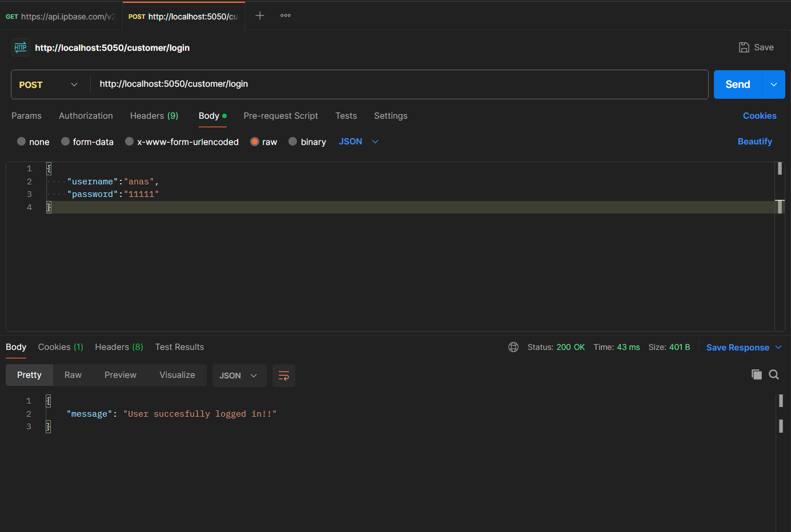

### Review Added

### Delete Review
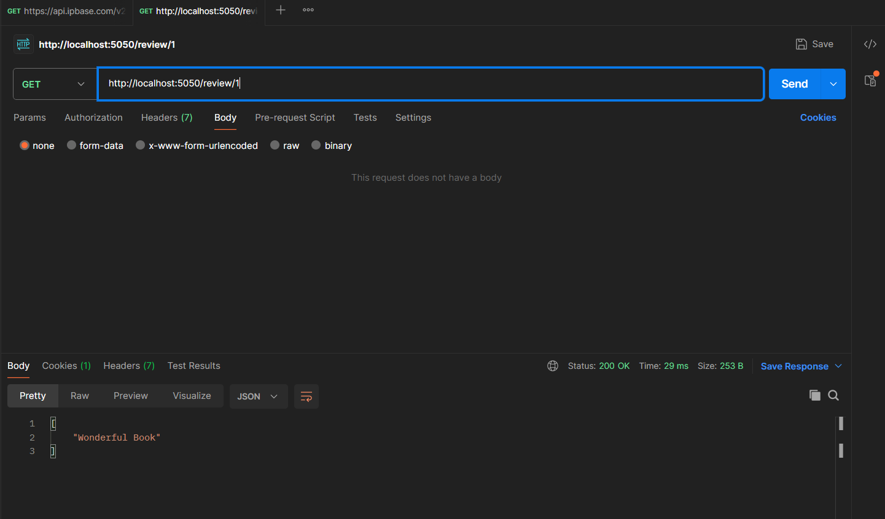

###  Get all books – Using async callback function
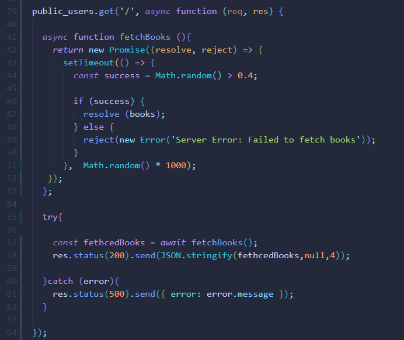

### Search by ISBN – Using Promises
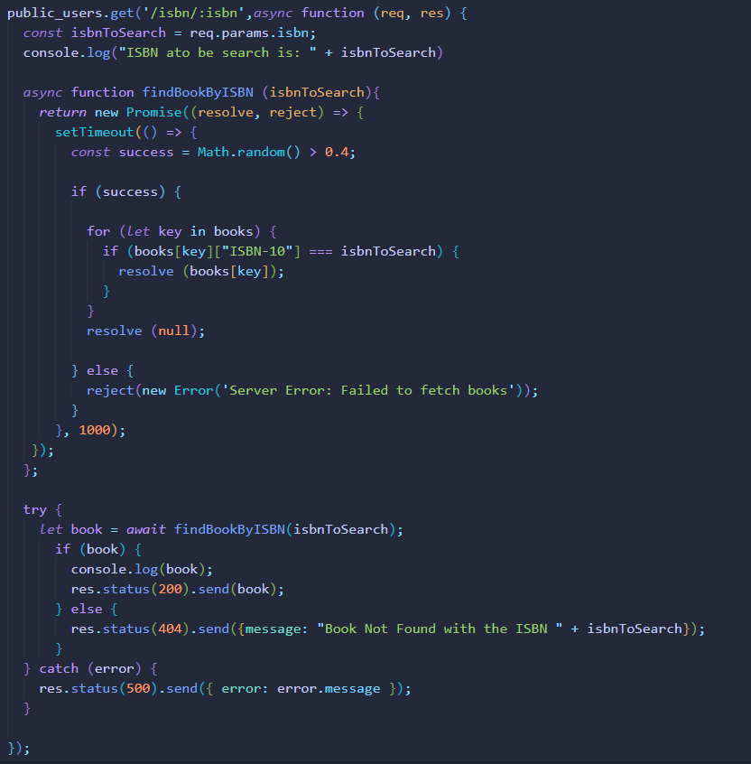

### Search by Author
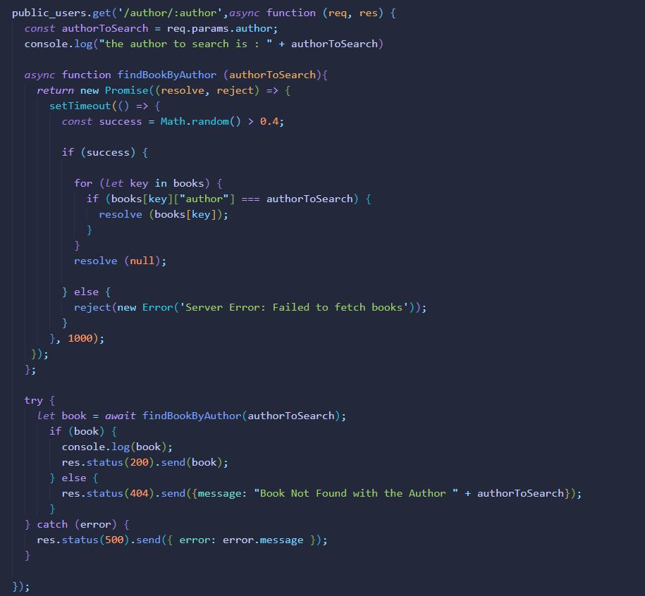

### Search by Title
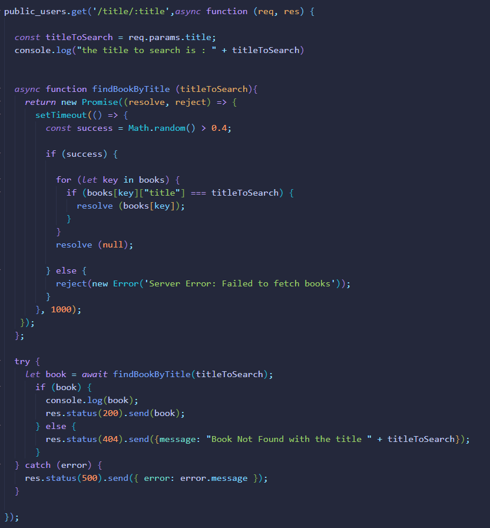
